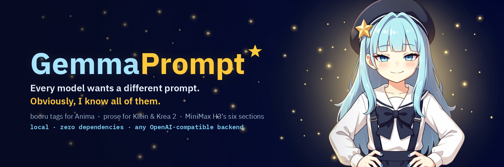

<p align="center">
  
</p>

# GemmaPrompt ★

A local prompt enhancer for ComfyUI diffusion models, with **Gemma-chan** as your
(extremely reluctant) prompt supervisor.

You type a rough idea. She rewrites it in the **native prompt dialect of the
model you're actually going to run** — Danbooru tags for Anima, dense prose for
FLUX.2 Klein, long descriptive paragraphs for Krea 2, and the full six-section
structured rewrite for MiniMax H3.

Runs entirely locally against any OpenAI-compatible LLM server. No API keys, no
telemetry, no pip install, no build step — the whole thing is Python standard
library plus three static files.

```bash
./run.sh
# → http://127.0.0.1:3939
```

---

## Why this exists

Every diffusion model wants a different kind of text, and getting it wrong costs
you real quality:

| Model | Wants | Gets destroyed by |
|---|---|---|
| Anima | comma-separated booru tags, in a specific order | flowing sentences |
| FLUX.2 Klein | 2–5 sentences of dense prose | tag soup, `(weight:1.2)` |
| Krea 2 Turbo | a rich 60–160 word paragraph | terse captions |
| Z-Image | a medium paragraph | quality-word stacking |
| MiniMax H3 | six labelled sections, exact field names, strict timing | anything else |
| Wan 2.2 / LTX 2.3 | one shot, one action, one camera move | multi-beat scripts |

GemmaPrompt keeps a written skill for each of these and loads the right one into
the LLM before it writes a single word.

---

## Requirements

- **Python 3.9+** — standard library only.
- **A local LLM server** exposing an OpenAI-compatible `/v1`. Tested with
  LM Studio + Gemma 4 31B. Also works with llama.cpp (`llama-server`), Ollama,
  KoboldCpp, text-generation-webui, TabbyAPI, vLLM, SGLang.
- **A vision-capable model** if you want to use reference images (optional).
- **Enough context.** The H3 skill is ~7.8k tokens of spec on its own — set your
  context to **32768** for H3, or 16384 as a bare minimum. If you run out,
  GemmaPrompt tells you exactly that instead of returning a blank box.
- **ComfyUI** (optional) — only for the tag database and artist-list export.

---

## Setting the backend

GemmaPrompt hunts for a server on the usual local ports at startup and prints
what it finds. To change it at runtime open **⚙ → Backend**, hit **scan**, and
click whichever one you want. Or paste any base URL and it will be normalised
(`localhost:8080` → `http://localhost:8080/v1`).

```bash
./run.sh --backend http://127.0.0.1:8080/v1     # llama.cpp
./run.sh --backend http://127.0.0.1:11434/v1    # ollama
./run.sh --api-key sk-...                       # if your server wants auth
```

Ports probed automatically: 1234 (LM Studio), 8080/8081 (llama.cpp), 11434
(Ollama), 5001 (KoboldCpp), 5000 (text-gen-webui / TabbyAPI), 8000 (vLLM),
30000 (SGLang).

---

## What's in it

### A walkthrough that actually walks you through it
First run drops you into a guided tour — Gemma-chan spotlights each control in
turn and explains what it's for and why it matters. Hit **★ tour** any time to
run it again. Steps for controls that aren't relevant to your current model are
skipped automatically.

### Model profiles
Image and video profiles wired to the workflows in
`ComfyUI/user/default/workflows/2026-current/`. Picking one swaps the loaded
skill, the sensible temperature, the available options, and what Gemma-chan tells you
about how that model likes to be talked to.

### Danbooru artist browser
All **59,201 artist tags** with post counts, searchable, read straight from
ComfyUI's autocomplete database (150k tags total, no separate download). Star
your favourites; they persist. **→ ComfyUI** writes them into
`comfyui-prompt-composer`'s three artist dropdowns and Impact Pack's
`artists.txt` wildcard in one click.

### Tag sets
Fourteen curated Danbooru tag groups — quality, rating, framing, camera angle,
lighting, expression, hair, pose, clothing, setting, effects, style, negatives —
plus full-text search across all 150k tags. Anima gets these; prose models
quietly fold them into the description instead.

### MiniMax H3 mode
Implements MiniMax's own
[h3-prompt-writing skill](https://github.com/MiniMax-AI/MiniMax-H3/tree/main/skills/h3-prompt-writing),
with the upstream reference guides shipped verbatim in `skills/`. All five modes
(T2VA, I2VA, FL2VA, L2VA, Ref2VA), a duration slider that constrains cut timing,
verbatim dialogue placement inside `<d>` tags, and reference-label assignment.
Output is syntax-highlighted so you can see shots, labels and dialogue at a glance.

### Video references and reference analysis

Drop or choose images and videos together. Videos decode locally in the browser;
only downscaled JPEG samples go to your configured vision model. Choose 4, 8
(default), 16, or 32 frames **before importing**. Each video has playback controls,
a timestamped filmstrip, and a remove button. Imports can be cancelled. Browser
codec support varies; MP4/H.264 and WebM are good starting points.

**Analyze references** produces visual notes about appearance, movement, camera,
style, and pacing. **Fix my prompt** uses the references directly in the chosen
model's dialect. H3 keeps video frames grouped under `<Video N>` labels and
separates source timestamps from output cut times. Image-editing and I2V profiles
still require an actual source image.

Analysis uses evenly spaced frames, not every frame, and does not process audio.
Short cuts can fall between samples. More samples require more model context;
use fewer frames or increase the loaded model's context if it runs out. Requests
have a 64 MB payload budget, independent of shot count.

**H3 Shots** accepts any positive whole number; leave it blank for auto. There is
no shot-count cap. Increase **Settings → Max tokens** for long shot lists; a
truncated response is clearly marked and is not saved as a completed prompt.
Actual model output remains subject to its context and output capacity.

### Vision
Attach reference images and the LLM actually looks at them — three modes:
*inform the prompt*, *reproduce this image*, *style only*. For H3 Ref2VA this is
how `subject_definitions` gets written from what's really in your reference
frames rather than from generic guesses. Images are downscaled client-side
before they're sent.

### MiniMax Music 3 and H3 soundtrack direction

Choose **Music → MiniMax Music 3** for music captions. Describe the music in the
idea box, optionally add **Lyrics & section tags**, set **Vocals**, and enter
constraints such as tempo, required instruments, or exclusions. The generated
caption contains **Global Metadata**, **Vocal Details**, and **Arrangement**.
Bracketed tags guide section changes; lyric lines are never rewritten into the
caption. Instrumental mode excludes vocals, including conflicting lyric tags.

The profile reads your installed `~/.claude/skills/music-caption-rewriter` skill.
To use another installation, set `GEMMA_MUSIC_SKILL` to that skill's directory
before starting the server. The same configured LLM chooses up to two style
families from the genre router, compares only those family indexes, reads up to
three selected templates, then writes a new caption. No template database,
embeddings, extra dependencies, or external music API is used. The UI reports
progress during selection. Selection uses [LM Studio-compatible structured JSON](https://lmstudio.ai/docs/developer/openai-compat/structured-output) when supported, with local validation of every selected file. The music skill must be installed; a missing file
produces a message with its path and the configuration option.

**copy** copies the caption. **copy original lyrics** keeps the original lyrics
and tags unchanged; **copy caption + lyrics JSON** exports `instructions` (the
caption) and `input` (the original lyrics). These buttons use the inputs belonging
to that completed result, even if you subsequently edit the form. Music results
and their associated lyrics can also be restored from history.

For **MiniMax H3 video**, choose **Background score → describe the soundtrack**
and enter instruments, pulse, development, and vocal exclusions. Those directions
go into H3's `non_diegetic_music` field while preserving its video section format.
**No score** sets that field to `N/A` and preserves dialogue and scene sounds.
Music 3 captions and H3 video prompts use different output formats; neither mode
renders audio itself.

### Thinking control
Reasoning is **always stripped** from the copied prompt and shown separately in a
collapsible panel — regardless of whether your model emits `reasoning_content`
or inline `<think>` tags. On top of that you can turn thinking **off**, **on**,
or supply a **prefill** that seeds the assistant turn.

### System prompt injection
Append, prepend, or fully replace the built-in skill. **Show assembled system
prompt** dumps exactly what gets sent, so nothing is hidden from you.

### VRAM handoff
The LLM and your diffusion model compete for the same card. The VRAM pill in the
header unloads the selected LLM on demand, or tick **unload after each prompt** and the
GPU is handed back the moment your prompt is written. Works with local LM Studio (via
the `lms` CLI) and Ollama (`keep_alive: 0`).

---

## Layout

```
server.py            zero-dependency HTTP server, LLM proxy, tag index
run.sh / restart.sh  launcher (restart.sh uses a pidfile)
skills/
  _core.md              universal rules
  anima.md              booru-tag dialect
  klein.md              FLUX.2 prose
  klein-edit.md         instruction-style editing
  krea2.md              long-form descriptive
  zimage.md             mid-length prose
  video-wan-ltx.md      video motion prose
  h3.md                 H3 operating procedure
  h3-base-modes.txt     upstream MiniMax guide (T2VA/I2VA/FL2VA/L2VA)
  h3-full-reference.txt upstream MiniMax guide (Ref2VA)
data/
  profiles.json         model profiles + Gemma-chan's lines
  tagsets.json          curated Danbooru tag groups
web/                 index.html, style.css, app.js, img/
```

**The skills are plain markdown — edit them.** They are the whole product. If
you disagree with how a model should be prompted, change the file and restart;
there is no build step and nothing is compiled in.

---

## Options

```
--port 3939                  listen port
--host 127.0.0.1             bind address
--backend URL                default OpenAI-compatible endpoint
--api-key KEY                bearer token, if needed
--tags PATH                  Danbooru autocomplete .txt
--comfy PATH                 ComfyUI root, for artist-list export
```

Environment equivalents: `GEMMA_BACKEND`, `GEMMA_API_KEY`, `GEMMA_TAGS`,
`GEMMA_COMFY`.

---

## Notes

- Nothing leaves your machine. The server talks to localhost and serves
  localhost.
- `Ctrl/Cmd+Enter` in the idea box generates. `Esc` closes any drawer.
- Favourites, history and settings live in `localStorage`.
- Gemma-chan was drawn locally: Anima for the first pass, then FLUX.2 Klein 9B
  edit to clean up the expression set. The banner background is Klein edit too —
  she was composited onto a wide canvas and the white was replaced in one edit
  pass. Everything lives in `web/img/`.

Credit: the H3 reference guides in `skills/` are MiniMax's, taken unmodified
from the MiniMax-H3 repository.

## Development checks

```bash
python3 -m unittest discover -s tests -v
node --test tests/media.test.js
node --check web/app.js
```

Regression coverage includes video grouping and timestamps, unrestricted shot
counts, malformed requests, stream termination, reasoning prefill, negative tags,
selected-model unloading, music reference selection, lyric/tag preservation,
and music/video format isolation. Live model tests are optional; the test suite uses
a local mock backend and never unloads real models.
